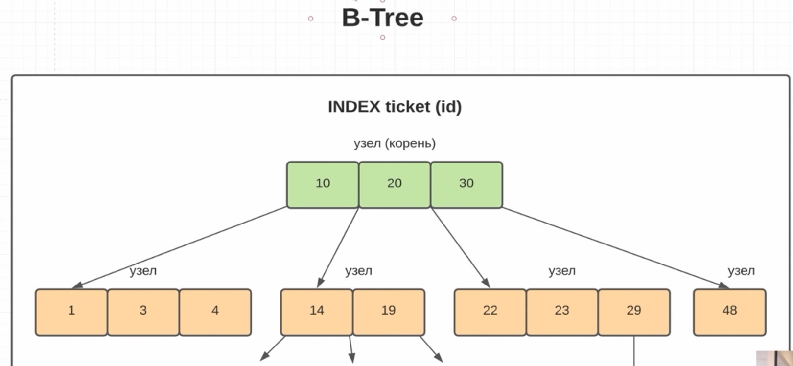
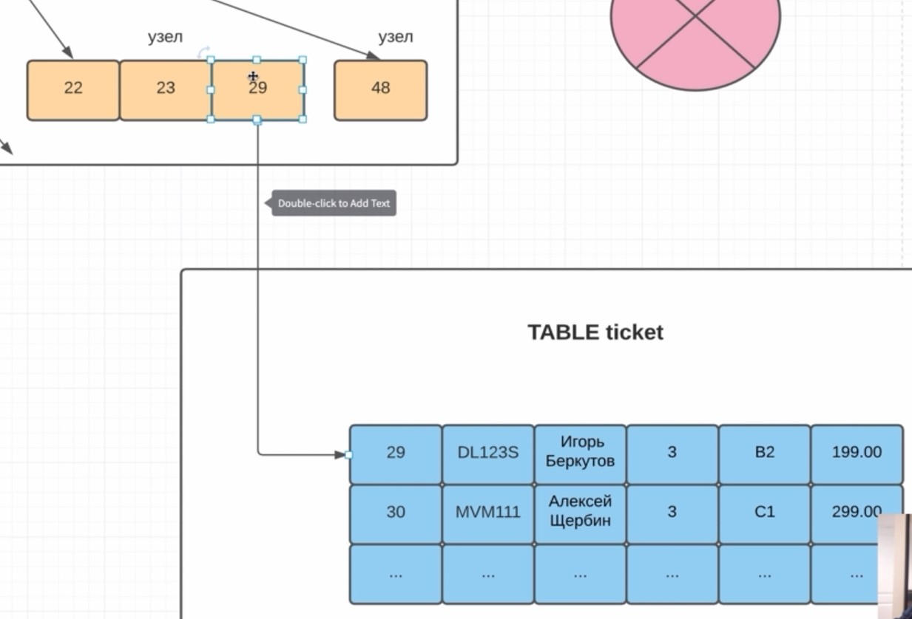

## Введение
Общая структура БД:


SQL (Standart Query Language) - язык для взаимодействия с реляционными БД.

Базы данных:

- предназначены для **долговременного** хранения информации
- Позволяют быстро находить нужные данные, так как обладают встроенными системами поиска
- **Реляционные БД** используют табличную структуру для хранения данных, а для работы с ними используется язык SQL

Реляционные - так как между таблицами есть взаимосвязь (relation)

СУБД (система управления базой данных) - приложение которое может выполнять CRUD операции с файлами (каталогами БД) на жестком диске. Организует работу с БД и добавляет дополнительную функциональность.

Каждая СУБД обладает своими отличиями, например, встроенными типами данных.

Так же каждая СУБД снабжена своим процедурным языком программирования и позволяет записывать хранимые процедуры. В современной разработке это не так распространено, потому, что вся логика в основном находится в backend-приложении.

## Подключение к БД

При обращении к сайту в браузере по имени, мы на самом деле обращаемся к ip-адресу. Чтобы не запоминать все адреса была введена DNS (domain name system), по сути это ассоциативный массив из имени сайта и его ip.

На одной машине может быть развернуто несколько приложений, и каждое из них резервирует свой порт.

По умолчанию 80 для http, 443 для https, поэтому при переходе на сайты достаточно ввести только название сайта.

## DDL & DML


```sql
CREATE DATABASE company_repository; - создать БД
DROP DATABASE company_repository; - удалить БД
```

Всегда при создании новой БД создаются три sсhema: public, information_schema, pg_catalog.

Schema по умолчанию - public

information_schema, pg_catalog - конфигурационные схемы (аналог JDK, использование классов Math, Array) 
information_schema - информация о таблицах в БД.
pg_catalog - агрегирующие функции, кастомные типы данных.

schema по аналогии с Java - это пакет. Служит для логического разделения таблиц.

При создании таблицы схема указвается через .

```sql
CREATE TABLE company_storage.company (
    id INT PRIMARY KEY ,
    name VARCHAR UNIQUE NOT NULL ,
    date DATE NOT NULL CHECK ( date > '1995-01-01' AND date < '2020-01-01')
);
```

Constraints - ограничения в таблице поддерживающие целостность данных:

- NOT NULL
- UNIQUE - значение уникальное
- CHECK 
- PRIMARY KEY == UNIQUE NOT NULL может быть только один
- FOREIGN KEY

Constraints можно указывать не только после названия колонки, но и в конце, перечисляя в скобках названия колонок, к которым он относится

```sql
    PRIMARY KEY(id, name)
```

## Primary key

Primary key - должен быть UNIQUE и NOT NULL, кроме того ровно одно такое поле для каждой таблицы.

Если указывать тип этого поля INT, то нужно запоминать какие id уже были введены, иначе будем получать ошибку duplicate.

Решение - тип SERIAL (аналог INT), BIGSERIAL(BIGINT), SMALLSERIAL(SMALLINT)

Данный механизм работает благодаря специальной сущности в Postgres - sequences.

Последовательности можно создавать самому - create sequences. Это бывает нужно, если необходимо создать общую последовательно для нескольких таблиц.

Последовательности есть не во всех СУБД, в MySQL их нет, там есть автоинкремент.

Иногда в качестве первичного ключа задают совокупность нескольких столбцов. В этом случае нужно всегда проверять наличие этих полей в БД при доавлении новой записи. Но проще задать Constraint UNIQUE на эти поля

```sql
CREATE TABLE employee
(
    id         INT PRIMARY KEY,
    first_name VARCHAR(128) NOT NULL ,
    last_name  VARCHAR(128) NOT NULL ,
    salary     INT,
    UNIQUE (first_name, last_name)
);
```

## SELECT

```sql
SELECT DISTINCT             -- выбрать единственную запись
    first_name AS f_name,   -- AS в Postgres можно опустить
    last_name AS l_name,
    salary
FROM employee AS empl
ORDER BY first_name, salary DESC -- по умолчанию ASC, сначала по первому полю, потом по второму
LIMIT 2                          -- выбрать ровно две записи
OFFSET 2;                        -- пропустить первые две записи
```

LIMIT и OFFSET поддерживаются не всеми СУБД.

Фильтрация выборки:

WHERE first_name LIKE '%van%'

% - любая последовательность символов. LIKE чувствителен к регистру.

WHERE salary BETWEEN 100 AND 500 - попадает ли выборка в диапазон

WHERE salary IN (100, 200, 300) - находится ли условие в множестве.

Если в колонке есть null, то COUNT не будет учитывать записи с null, а count(*) посчитает колличество всех записей.

CONCAT('a', 'b') - конкатенация строк.

Почти все СУБД поддерживают такую конкатенацию: 'a' || 'b'

now() - текущая дата сервера.

В schema pg_catalog можно посмотреть все доступные функции (routins) и операторы (operator)

## FOREIGN KEY

```sql
company_id INT REFERENCES company (id) ---более предпочтительный вид записи, тип должен совпадать с company_id

FOREIGN KEY (company_id) REFERENCES company
```

Для внешнего ключа никаких индексов автоматически не создаётся. NOT NULL так же нет.

Использование внешнего ключа даёт нам согласованность данных. Мы не можем добавить id компании, которой не существует.
Так же мы не сможем удалить компанию, на которую есть ссылка из другой таблицы.

FOREIGN KEY - это такой же CONSTRAINT как UNIQUE, NOT NULL.

Для проверки поля на NULL используется ключевое слово IS

UNION ALL используется для объединения запросов из нескольких таблиц, либо логически разбитый сложный запрос из одной таблицы. Результаты выборок при этом должны иметь одинаковое колличество столбцов и столбцы должны иметь одинаковый тип.

UNION обрезает дублирующие значения.

## Подзапросы

При использовании подзапроса в FROM необходимо использовать альяс

```sql
SELECT 
    AVG(empl.salary)
FROM (SELECT
          *
      FROM employee
      ORDER BY salary DESC
      LIMIT 2) empl;

SELECT *,
       (select max(salary) from employee) - salary diff
FROM employee;

SELECT *
FROM employee
WHERE company_id IN (select company.id FROM company WHERE date > '2000-01-01');
```

##DELETE

```sql
DELETE FROM employee
WHERE salary = (SELECT MAX(salary) FROM employee);
```

При операции DELETE есть ограничения по FOREIGN KEY.

Возможно задать поведение при удалении главной сущности, на которую ссылается внешний ключ.

```sql
company_id INT REFERENCES company (id) ON DELETE CASCADE

-- NO ACTION, RESTRICT - по сути одно и то же, действия не предпринимаются
-- SET DEFAULT
-- SET NULL
```

## UPDATE

UPDATE и DELETE возвращают только количество строк, которые они обновили.

```sql
UPDATE employee
SET company_id = 2,
    salary = 1000
WHERE id = 1
RETURNING id, first_name || ' ' || last_name as fio; -- поддерживается не всеми СУБД
```

RETURNING может понадобиться при логировании удаленных строк из БД.

## Нормализация баз данных

Нормализация - это метод проектирования базы данных, который позволяет привести базу данных к минимальной избыточности.

Избыточность данных - это когда одни и те же данные хранятся в базе в нескольких местах (таблицах), именно это и приводит к различным аномалиям.

Нормальная форма базы данных - это набор правил и критериев. которым должна отвечать база данных.

Всего 9 нормальных форм
1. Ненормализованная форма или нулевая формальная форма (UNF)
2. Первая нормальная форма (1NF)
3. Вторая нормальная форма (2NF)
4. Третья нормальная форма (3NF)
5. Нормальная форма Бойса-Кодда (BCNF)
6. Четвертая нормальная форма (4NF)
7. Пятая нормальная форма (5NF)
8. Доменно-ключевая нормальная форма (DKNF)
9. Шестая нормальная форма (6NF)

Каждая последующая форма включает в себя ограничения всех предыдущих.

Чем выше форма, тем ниже производительность. Чем более строгая форма, тем более сложный запрос нужно сделать приложению, а то и несколько запросов.

Другими словами нормализация БД означает соблюдение некоторых нормальных форм.

## 1 Нормальная форма

1. В таблице не должно быть дублирующих строк
2. В каждой ячейке таблицы хранится атомарное значение
3. В столбце хранятся данное одного типа

## 2 Нормальная форма

1. Таблица должна находиться в 1 НФ
2. Таблица долна иметь первичный ключ (PRIMARY KEY)
3. Все неключевые столбцы таблицы должны полностью зависить от полного первичного ключа (в случае если он составной) Избыточность первичного ключа.

## 3 Нормальная форма

1. Таблица должна находиться в 2 НФ
2. В таблице должна отсутствовать транзитивная зависимость неключевых столбцов.

Итог:

1НФ - наше внимание нацелено на соблюдение простейших реляционных принципов (нет дублирования и атомарные значения в ячейках)
2НФ - наше внимание нацелено на первичный ключ.
3НФ - наше внимание нацелено на неключевые столбцы.

## Связи между таблицами

1. 1 к 1
2. 1 к N
3. M к N

UML - Unified Model Language

UML - это язык графического описания для объектного моделирования в области разработки программного обеспечения, моделирования бизнес-процессов, системного проектирования и отображения организационных структур.

ERD - Entity Relationship Diagram.

## JOIN

INNER JOIN отсекает все записи, у которых внешний ключ NULL.

LEFT JOIN - отображаются все записи первой таблицы (слева), даже если нет ссылки на вторую таблицу.

RIGHT JOIN - отображаются все записи справа.

FULL JOIN = LEFT JOIN + RIGHT JOIN.

В случае INNER JOIN условия можно указывать как в блоке ON, так и в последующем WHERE.

А в случае других JOIN, даже если указать условия в блоке ON все равно, либо левая, либо правая таблица будет отображена.

## Оконные функции

Позволяют применять агрегирующие и другие специальные функции к части строк, объединенных общим признаком.

OVER() - открытие окна

```sql
SELECT company.name,
       e.last_name,
       COUNT(*) OVER ()
FROM company
LEFT JOIN employee e
    ON company.id = e.company_id
ORDER BY company.name;
```

rank() - ранжирует с пропуском

dense_rank() - ранжирует без пропуска

lag() - разница между текущей строкой и предыдущей

В окне можно упорядочивать записи. Указывать что делать с нулевыми полями.

rank() OVER (partition by company.name ORDER BY e.salary nulls first )

partition by - разделение окна по определенному полю

## VIEW

VIEW - являются отображениями таблиц, в них обычно нельзя вставлять, удалять, изменять данные. Они служат для отображения таблиц.

View позволяют сокращать сложные запросы

```sql
CREATE VIEW employee_view AS
SELECT company.name,
       e.last_name,
       e.salary,
       COUNT(e.id) OVER (),
       max(e.salary) OVER (),
       rank() OVER (partition by company.name ORDER BY e.salary nulls first )
FROM company
LEFT JOIN employee e
    ON company.id = e.company_id
ORDER BY company.name;

SELECT * FROM employee_view
WHERE name = 'Facebook';
```

При запросе к View так же происходит выполнение sql-запроса, кэширования нет.

Если в запросе в View есть индексы у полей, то они используются и в запросе к самому View.

MATERIALIZED VIEW - разновидность View, когда результаты запроса хранятся в БД. Но изменять данные так же нельзя.

При изменении исходных данных, эти изменения отобразятся в обычном View, но не отобразятся в Materialized View.
Materialized View обновляется с помощью команды:

```sql
REFRESH MATERIALIZED VIEW m_employee_view;
```

Обычно создаются jobы, которые обновляют View раз в промежуток времени, сами View используются для сбора статистики.

По сути View это аналог доступа Read-Only, при этом будет доступ только к данным во View, то есть часть данных можно скрыть.

## Изменение таблиц. ALTER TABLE.

В реальных БД содержится огромное колличество данных. И при изменении структуры БД нельзя их удалять и записать снова, это потребует много времени.

interval - получить временной интервал

:: в Postgres приведение к типу данных

```sql
SELECT INTERVAL '2 years 1 days';
SELECT (now() - interval '2 years 1 days');
SELECT (now() - interval '2 years 1 days')::date; --приведение к типу данных date
SELECT (now() - interval '2 years 1 days')::time;
```

Для извлечение из date (год, месяц и т.д.) есть функция Extract.

SELECT EXISTS(select 1 from ticket where id = 2000); - булевый оператор EXISTS();

Вместо названия колонки в order by можно ставить номер колонки

```sql
select t.passenger_name,
       count(*)
from ticket t
group by t.passenger_name
order by 2 desc;
```

lead() - значение следующего элемента. lag() - предыдущего.

COALESCE(lead(t1.sum_cost) over (order by t1.sum_cost), 0) - заменить null на 0.

## Множества

UNION ALL - полное объединение.

UNION - объединение с исключением повторяющихся элементов

INTERSECT - пересечение

EXCEPT - есть в первом множестве и отсутствует во втором.

## Индексы

Индексы служат для быстрого поиска в БД (чаще всего по id). БД представляет собой большой фаил, в котором при поиске последовательно считываются строки, для ускорения поиска были введены индексы.

Индексы в Postgres бывают разных видов.

## B-Tree индексы. 

Каждый узел может иметь максимум N+1 child.



Обычно элементы в узле находятся в одной области жесткого диска, и такая структура нужна для того, чтобы как можно меньше обращаться к жесткому диску.



Кроме индекса узел хранит в себе ссылку на реальную БД. Эта ссылка ведет на другой файл (не файл индекса).

Ссылка может быть представлена смещением количества байт от начала файла таблицы, чтобы найти искомую строку.

Для минимизации перемещения между файлам существуют кластерные индексы, которые рядом со значением хранят и всю строку и перемещение не требуется. 

На одну таблицу может быть один кластерный индекс.

```sql
CREATE UNIQUE INDEX unique_flight_id_seat_no_idx ON ticket (flight_id, seat_no);
```
В составном индексе важен порядок, по сути это конкатенация строк.

Для решения использовать ли index scan или full scan влияет селективность.

Селективность - отношение уникальных строк в таблице и всех строк.

Хорошая селективность близка к 1.

Операции изменения данных (добавляение, удаление, изменение) заставляют каждый раз персчитывать индекс. Поэтому следует осторожно вводить индексы.

## План выполнения запросов

```sql
explain select * from ticket;
```

Seq Scan on ticket  (cost=0.00..1.55 rows=55 width=60)

Explain выполняет план запроса, а не сам запрос.

Seq scan - полный скан таблицы.

**cost** - стоимость запроса.
**rows** - колличество строк.
**width** - среднее количество байт на одну строку.

Раньше оптимизатор был синтаксическим (ruled-based), но он оказался не эффективным.
Ему на замену пришёл стоимостной (cost-based)

1. page-cost - стоимость ввода вывода, мы можем считывать данные с жесткого диска по страницам (фрагментам), на одну страницу 1.0 стоимости
2. cpu-page - сколько операций сделал процессор для каждой строчки. Стоимость одной операции 0,01

cost = 1.55 = 55 * 0,01 + 1.0

Для определения page-cost, в postgres хранится схема pg_catalog, в которой есть таблица pg_class. В ней хранятся статистические данные по всем таблицам, на основании которых определяется стоимость ввода-вывода.

```sql
select *
from pg_catalog.pg_class
where relname = 'ticket';
```

reltuples - колличество строк в таблице. Обновляется не всегда

relkind - вид таблицы

relpages - сколько страниц занимает наша таблица.

width = BIGINT (8 байт) + 6 + 28 + BIGINT (8 байт) + 2 + NUMERIC (8 байт) = 60 байт.

```sql
select
    avg(bit_length(passenger_no)/8), -- 6
    avg(bit_length(passenger_name)/8), -- 28
    avg(bit_length(seat_no)/8) -- 2
from ticket;
```

При добавлении условий фильтрации стоимость запроса растёт, но основная составляющая стоимости - считывание и запись на диск.

```sql
explain select flight_id, count(*)
from ticket
group by flight_id;
```

HashAggregate  (cost=1.82..1.92 rows=9 width=16)<br>
    Group Key: flight_id<br>
    ->  Seq Scan on ticket  (cost=0.00..1.55 rows=55 width=8)

analyse test1; - обновить статистику по таблице.

```sql
explain
select *
from test1
where number1 = 1000;

>>
Index Scan using test1_number1_idx on test1  (cost=0.29..12.77 rows=3 width=21)
  Index Cond: (number1 = 1000)
```

При использовании or в условии where можно знчительно понизить производительность (эффект от индекса)

**index only scan** - задействует только индекс. После нахождения значения не делаем запрос в таблицу. Все возвращаемые данные содержатся в индексе.

**index scan** - дополнительно обращаемся к таблице. Будет несколько операций считывания.

**bitmap scan** - всегда состоит из двух частей. index scan, создает Bitmap (последовательность 0 и 1) на основании которой heap scan определяет на каких страницах нужно искать.

0 1 0 1 0 0 0 1 1 0 ... 636 times

Определяем номера страниц с которых нужно считать данные batch (одним запросом)

2, 4, 8, 9 ...

Bitmap scan умеет работать с несколькими индексами, выполняя побитовые операции с Bitmap для каждого индекса.

```sql
explain
select *
from test1
where number1 < 1000
  and number2 > 80000
  and value = '12345';

>>

Bitmap Heap Scan on test1  (cost=125.52..415.23 rows=1 width=21)
  Recheck Cond: ((number2 > 80000) AND (number1 < 1000)) -- проверяем условия в данных полученных после batch запроса на основании Bitmap.
  Filter: ((value)::text = '12345'::text)
  ->  BitmapAnd  (cost=125.52..125.52 rows=112 width=0) -- побитовое and
        ->  Bitmap Index Scan on test1_number2_idx  (cost=0.00..35.43 rows=2019 width=0) -- создаем первую map
              Index Cond: (number2 > 80000)
        ->  Bitmap Index Scan on test1_number1_idx  (cost=0.00..89.83 rows=5539 width=0) -- создаем вторую map
              Index Cond: (number1 < 1000)

```

## План выполнения запросов JOIN.

Для просмотра более детальной характеристики по запросу, необходимо его выполнить.

```sql
explain analyse
select *
from test1
join test2 t on test1.id = t.test1_id
limit 100;
```

### Nested Loop

```sql
Limit  (cost=0.29..36.58 rows=100 width=42) (actual time=0.011..0.123 rows=100 loops=1)
  ->  Nested Loop  (cost=0.29..36288.95 rows=100000 width=42) 
      (actual time=0.010..0.116 rows=100 loops=1) -- действительное время и колличество записей
        ->  Seq Scan on test2 t  (cost=0.00..1637.00 rows=100000 width=21) 
            (actual time=0.004..0.009 rows=100 loops=1)
        ->  Index Scan using test1_pkey on test1  (cost=0.29..0.35 rows=1 width=21) 
            (actual time=0.001..0.001 rows=1 loops=100) -- loop был использован 100 раз.
              Index Cond: (id = t.test1_id)
Planning Time: 0.418 ms -- планируемое время
Execution Time: 0.141 ms -- реальное время выполнения

```
По id из test1 Index Scan так как есть индекс на это поле, по test1_id из test2 Full Scan, так как индекса нет.
Затем Nested Loop делает Join.

**Nested Loop** - используется при небольшом колличестве записей. Nested Loop проходит по всей таблице test2 и по индексу ищет id в таблице test1, проверяя условия соединения.

### Hash Join

```sql
explain analyse
select *
from test1 t1
join test2 t2 on t1.id = t2.test1_id;
```

```sql
Hash Join  (cost=2887.00..4786.51 rows=100000 width=42) (actual time=17.069..47.798 rows=100000 loops=1)
  Hash Cond: (t2.test1_id = t1.id)
  ->  Seq Scan on test2 t2  (cost=0.00..1637.00 rows=100000 width=21) (actual time=0.004..4.644 rows=100000 loops=1)
  ->  Hash  (cost=1637.00..1637.00 rows=100000 width=21) (actual time=16.781..16.782 rows=100000 loops=1)
        Buckets: 131072  Batches: 1  Memory Usage: 6287kB
        ->  Seq Scan on test1 t1  (cost=0.00..1637.00 rows=100000 width=21) (actual time=0.003..4.716 rows=100000 loops=1)
Planning Time: 0.155 ms
Execution Time: 50.704 ms

```
Происходит полное сканирование таблицы test1. Т.к. колличество записей велико, и индекс хранит только значение id и ссылку на строку в таблице, то понадобится большое количество операций обращения к таблице. Поэтому на основе таблицы test1 создаётся хэш таблица, получение данных из которой происходит за очень малое время.

Далее таблица test2 сканируется полностью и по id быстро происходит join с данными из hash-таблицы.

Buckets: - сколько было создано бакетов.

Batches: 1  Memory Usage: 6287kB - всё, что больше одного, значит было обращение к жесткому диску. ОЗУ не хватило.

### Merge Join

```sql
explain analyse
select *
from test1 t1
join (select * from test2 order by test1_id) t2 on t1.id = t2.test1_id;
```

Для Merge Join необходимо, чтобы обе таблицы были отсортированы. Далее происходит слияние двух отсортированных массивов id (таблиц)
Обычно создают индекс на внеший ключ, чтобы не сортировать вручную.

## Работа в командной строке

Подключение к БД:
```
psql --host=localhost --port=5432 --dbname=flight_repository --username=postgres
```

\l - посмотреть все БД

\d - список таблиц (в том числе и sequences)

\dt - список только таблиц

\d имя таблицы - информация о таблице.

\c - поменять БД

pg_dump - создание dumpа БД.

psql -c "create database new_db" - выполнять команду sql без входа в БД.

## Транзакции и блокировки

Транзакция - единица работы в рамках соединения с базой данных.

1. Commit - выполняется полностью
2. Rollback - полностью откатывается.

ACID - набор свойств, которыми должна обладать транзакция БД.
Atomicity - атомарность, гарантирует, что никакая транзакция не будет зафиксирована в системе частично.
Будут выполнены все её подоперации, либо не будет выполнено ни одной

Consistency - согласованность. Каждая успешная транзакция фиксирует только допустимые результаты.

Isolation - изолированность. Во время выполнения транзакции, параллельные транзакции не должны оказывать влияние на её результат.

Durability - устойчивость. Независимо от проблем на нижних уровнях изменения, сделаные успешно завершённой транзакцией, должны остаться сохранёнными после возвращения системы в работу. Достигается средствами Log table, которые фиксируют все изменения в БД и позволяют восстановить систему после перебоя.

Transaction isolation issues

Lost update - происходит, когда обе транзакции одовременно обновляют данные, а затем вторая транзакция откатывает изменения, вследствии чего изменения обеих транзакций теряются.


Dirty read - происходит, когда первая транзакция читает изменения, сделанные другой транзакцией, но эти изменения ещё не были ей закомичены. После чего вторая транзакция откатывает эти изменения, а первая продолжает работы с "грязными" данными.


